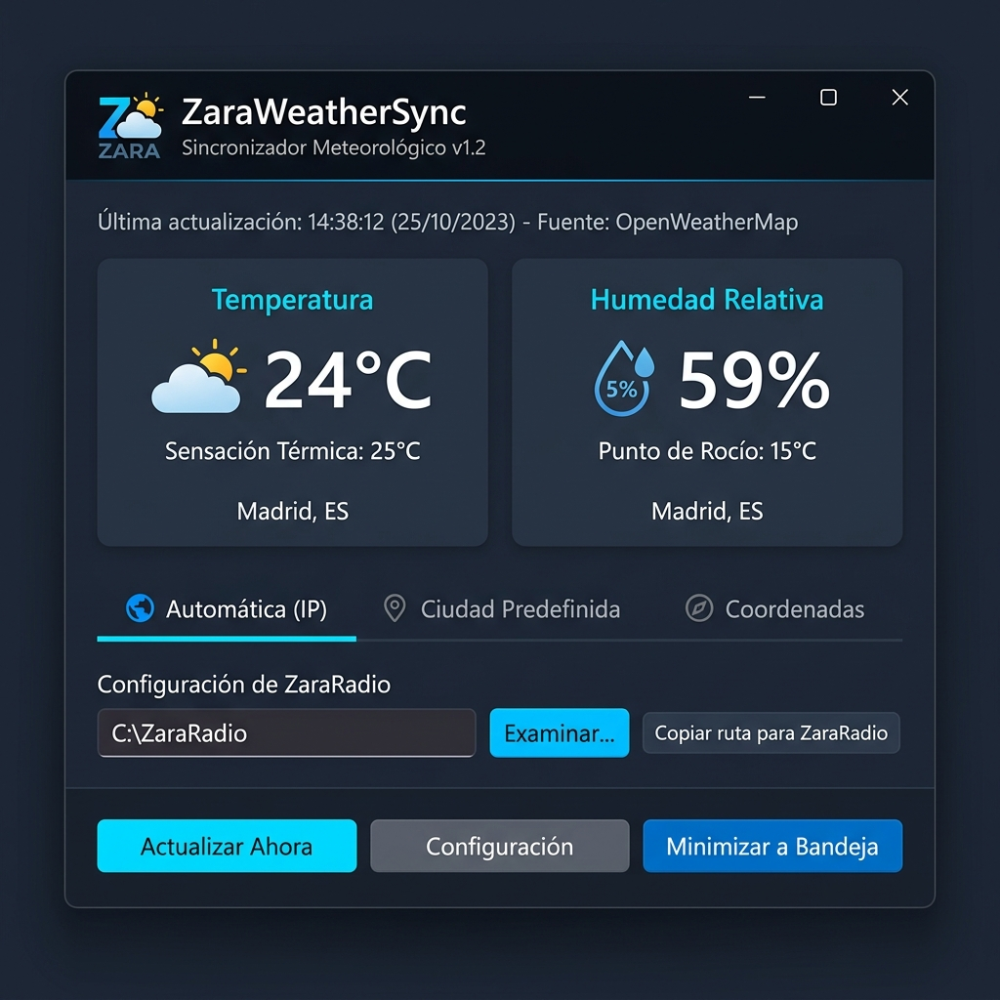

# ZaraWeatherSync 🌦️📻
**Complemento meteorológico autónomo para el software de automatización radial ZaraRadio.**

<p align="center">
  <a href="https://cafecito.app/henu_45" target="_blank" rel="noopener noreferrer">
    
  </a>
</p>

<p align="center">
  <b>¿Esta herramienta te es útil para tu estación de radio?</b><br>
  ¡Apoya el desarrollo y mantenimiento continuo invitándome un cafecito! ☕📻
</p>

<p align="center">
  
</p>

---

## 💾 Descargas Disponibles (Windows)

Puedes descargar la última versión directamente desde [**GitHub Releases**](https://github.com/hernancussit/ZaraWeatherSync/releases/latest):

| Tipo | Archivo | Descripción |
| :--- | :--- | :--- |
| 🌟 **Recomendado** | [**`ZaraWeatherSync_Setup.exe`**](https://github.com/hernancussit/ZaraWeatherSync/releases/latest) | **Asistente de Instalación**: Configuración guiada en español, crea accesos directos en el Menú Inicio y Escritorio, y registra el desinstalador limpio en Windows. |
| 🧰 **Portable** | [**`ZaraWeatherSync.exe`**](https://github.com/hernancussit/ZaraWeatherSync/releases/latest) | **Ejecutable autónomo**: No requiere instalación previa; ideal para pendrives o carpetas de radio dedicadas. |

---

## 🚀 Características Principales

- **Diseño Moderno y Oscuro (CustomTkinter)**: Tipografía nítida y tarjetas métricas de alta visibilidad para monitores de estudio de radio.
- **Inmunidad a Zoom DPI (125%, 150%) y Fuentes Grandes**: Contenedor desplazable suave (`CTkScrollableFrame`) con barra de acciones fija inferior que previene recortes en pantallas de cualquier resolución (incluso 1366x768).
- **Selector de Ubicación Versátil**:
  - **Ubicación Automática (IP)**: Con botón para **fijar permanentemente la ubicación detectada** y advertencia contextual para evitar inconsistencias causadas por IPs dinámicas o nodos distantes asignados por el proveedor de internet (ISP).
  - **Catálogo de Ciudades Mundiales**: Más de 50 ciudades principales predefinidas de Argentina, Latinoamérica, España y el mundo (Las Toscas, Buenos Aires, Córdoba, Rosario, Santiago, CDMX, Bogotá, Madrid, Miami, etc.).
  - **Coordenadas Manuales**: Edición directa de latitud y longitud para cualquier localidad rural o punto geográfico específico.
- **Unidades de Temperatura (°C / °F)**: Soporte completo para **Celsius** y **Fahrenheit**, sincronizado con la API de Open-Meteo y reflejado en `clima.txt`.
- **Frecuencia de Actualización con Protección de API**: Permite configurar el intervalo de consulta con validación de seguridad (mínimo 15 minutos para evitar bloqueos por sobrecarga de peticiones, máximo 1440 min / 24h).
- **Formato Estricto ZaraRadio con Escritura Atómica**:
  Genera y sobrescribe `clima.txt` cumpliendo con la sintaxis exacta esperada por los paquetes de locución horaria de ZaraRadio:
  ```text
  Temperature:25
  Humidity:60
  ```
  *(Sin espacios adicionales, números enteros redondeados y reemplazo atómico para evitar bloqueos de lectura en vivo).*
- **Selector de Carpeta con Verificación de Permisos**: Valida el acceso de lectura y escritura en la carpeta de ZaraRadio, advierte si se ubica dentro de `Archivos de Programa` (bloqueos por virtualización UAC de Windows) y ofrece el botón **"📋 Copiar ruta para ZaraRadio"** para copiar la dirección exacta al portapapeles.
- **Bandeja del Sistema (System Tray)**: Permite minimizar la aplicación al área de notificación de Windows con menú contextual interactivo para no estorbar en el escritorio de la radio.
- **Inicio Automático con Windows**: Registro en el Registro (`HKCU\Software\Microsoft\Windows\CurrentVersion\Run`) con arranque silencioso en bandeja (`--tray`).

---

## ⚙️ Configuración Paso a Paso en ZaraRadio

1. Abre **ZaraWeatherSync**.
2. En la sección **Destino del archivo clima.txt**, selecciona la carpeta donde deseas guardar el archivo (por ejemplo, `C:\ZaraRadio`).
3. Haz clic en el botón **"📋 Copiar ruta para ZaraRadio"**.
4. En **ZaraRadio**, dirígete a: **Herramientas > Opciones > Clima**.
5. En el campo **Archivo de clima**, pega la ruta copiada (presiona `Ctrl + V`).
6. Haz clic en **Aceptar**.
7. ¡Listo! Cada vez que ZaraRadio ejecute una locución horaria o evento programado de temperatura/humedad, anunciará los datos sincronizados.

---

## 🛠️ Instalación y Ejecución en Desarrollo

### Requisitos:
- **Windows 10 / 11**
- **Python 3.10 o superior**

### Pasos:
```powershell
# 1. Clonar el repositorio
git clone https://github.com/hernancussit/ZaraWeatherSync.git
cd ZaraWeatherSync

# 2. Crear y activar el entorno virtual
python -m venv venv
.\venv\Scripts\activate

# 3. Instalar dependencias
pip install -r requirements.txt

# 4. Generar iconos nativos
python assets\make_icon.py

# 5. Ejecutar la aplicación
python main.py
```

---

## 📦 Compilación de Ejecutable e Instalador
 
### 1. Generar Ejecutable Portable (`dist\ZaraWeatherSync.exe`)
Ejecuta el script automatizado:
```cmd
build_exe.bat
```

### 2. Generar Asistente de Instalación (`dist\ZaraWeatherSync_Setup.exe`)
Requiere [Inno Setup 6](https://jrsoftware.org/isdl.php). Ejecuta:
```cmd
build_installer.bat
```

---

## 🔄 Auto-Actualización en Vivo y CI/CD

### Auto-Actualización Integrada en la App
ZaraWeatherSync incluye un sistema de auto-actualización que:
1. Comprueba silenciosamente en GitHub Releases si hay una versión más reciente.
2. Muestra un banner visual con las novedades de la versión.
3. Permite descargar el nuevo binario con barra de progreso y sustituye el ejecutable en caliente en Windows sin bloqueos de archivo.

### Compilación y Publicación Automatizada con GitHub Actions
El repositorio incluye el workflow de CI/CD [`.github/workflows/release.yml`](.github/workflows/release.yml). Cada vez que creas y subes una etiqueta de versión (tag):

```cmd
git tag v1.2.1
git push origin v1.2.1
```

GitHub Actions compilará automáticamente en una máquina virtual Windows:
1. `ZaraWeatherSync_Setup.exe` *(Asistente de instalación)*
2. `ZaraWeatherSync.exe` *(Versión portable)*
3. `SHA256SUMS.txt` *(Sumas de comprobación criptográficas)*

Y publicará automáticamente un **GitHub Release** público con todos los archivos listos para su descarga.

---

## ☕ Apoya este Proyecto

Si este complemento te ha facilitado la automatización meteorológica en tu emisora radial, puedes colaborar con el proyecto a través de Cafecito:

<p align="center">
  <a href="https://cafecito.app/henu_45" target="_blank" rel="noopener noreferrer">
    
  </a>
</p>

[](https://cafecito.app/henu_45)

---

## 📄 Licencia

Distribuido bajo licencia MIT. Consulta `LICENSE` para más información.
